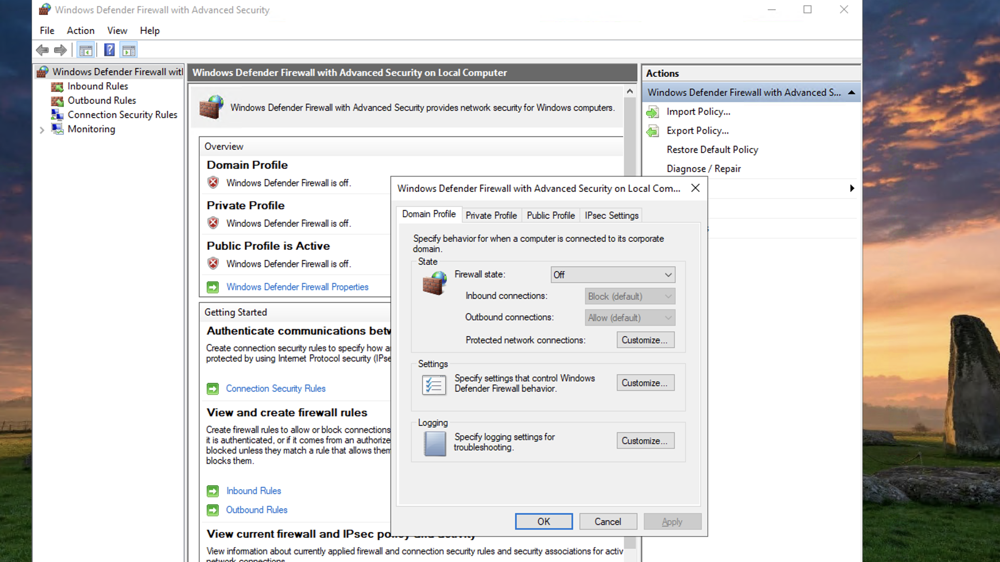
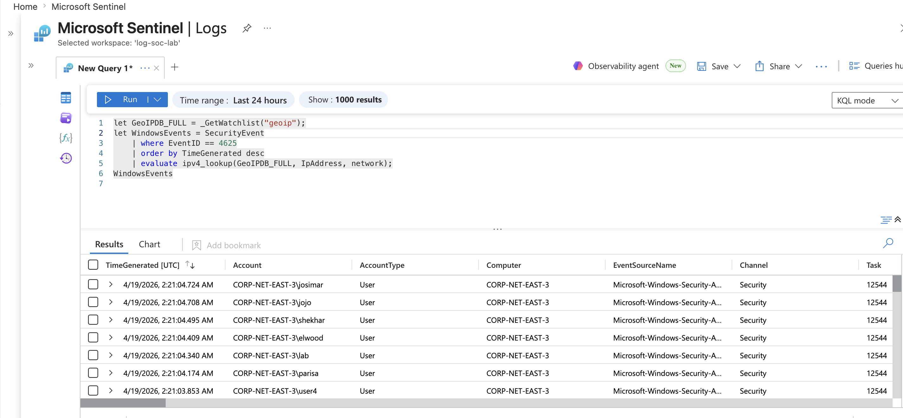

Cloud Honeypot & SIEM Lab Using Microsoft Sentinel

This project is a home SOC lab built inside of Microsoft Azure to study real world attack behaviour. I exposed a windows VM intentionally to the internet with all inbound firewall rules opened to attract unsolicited traffic. I then forwarded those security logs to a centralized log repository and connected it to Sentinel. I used KQL to scan through failed login attempts and built an attack map showing where the traffic originated from.

Tools I used 
- Azure
- Sentienl
- Log Analytics Workspace
- KQL
- Microsoft Virtual Machine

How I built the Lab

I setup a resource group in Azure with a virtual network, subnet and VM. I opened the network security group to allow inbound traffic as well as the firewall settings on the VM. While I waited for traffic I setup the Log Analystics Workspace and connected it Sentinel and from there I used Azure Monitoring Agent to forward the VM's security event logs into that workspace so that I can query them. Once the logs came in I used KQL to pull out information like the timestamp, IP, and account name. 

Screenshots

What I learned from this Project is that it doesn't take long for an exposed system to be attacked by bots/threat actors. This took a few hours but in that span I had over 50,0000 log attempts ranging from different IP's across the world but mainly in Poland as the screenshot shows. 

